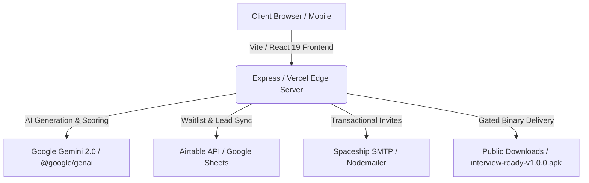

<div align="center">

# 📱 Interview Ready

**AI-Powered Career Readiness & Interview Acceleration Platform**

[](https://react.dev/)
[](https://www.typescriptlang.org/)
[](https://vitejs.dev/)
[](https://tailwindcss.com/)
[](https://appinterviewready.top/download)
[](LICENSE)

<br />

[Live Web Platform](https://appinterviewready.top) • [Download Android App](https://appinterviewready.top/download) • [Privacy Policy](https://appinterviewready.top/privacy) • [Terms of Service](https://appinterviewready.top/terms)

</div>

---

## 🌟 Executive Overview

**Interview Ready** is a high-performance career utility built for ambitious professionals looking to compete on a global scale. The platform automates resume and cover letter optimization, provides real-time voice-driven AI mock interviews, and delivers targeted interview flashcards to help candidates land interviews faster and negotiate higher compensation.

### Core Capabilities

- 🎯 **ATS Resume & Cover Letter Engine** – Tailors bullet points with high-impact metrics and industry-specific keywords tested against top Applicant Tracking Systems.
- 🎙️ **Voice AI Mock Interviews** – Conduct dynamic oral interview simulations with speech recognition, question branching, and instant confidence and pacing breakdowns.
- 📊 **Multidimensional AI Scoring** – Real-time feedback covering answer structure (STAR method), delivery clarity, and recruiter alignment.
- 📱 **Official Android Mobile App (`v1.0.0-beta`)** – Native mobile experience featuring offline question banks, flashcards, and practice sessions.
- 🔒 **Gated Early-Access Download Portal** – Secure 15-minute time-bounded download sessions protected by email verification, Airtable synchronization, and Spaceship SMTP dispatch.

---

## 🏗️ Architecture & Technology Stack



### Frontend
- **Framework**: [React 19](https://react.dev/) + [TypeScript](https://www.typescriptlang.org/)
- **Build Tool**: [Vite 6](https://vitejs.dev/) with Fast Refresh
- **Styling**: [Tailwind CSS v4](https://tailwindcss.com/)
- **Icons & Animation**: [Lucide React](https://lucide.dev/), [Motion](https://motion.dev/)

### Backend & Cloud Services
- **Runtime**: Node.js 22 LTS with Express & `tsx`
- **Deployment**: Vercel Serverless Functions (`/api/*`) and Node.js CJS Bundles (`dist/server.cjs`)
- **AI Integration**: Google Gemini API via `@google/genai`
- **Database / CRM**: Airtable REST API & Google Sheets API
- **Email Delivery**: Spaceship SMTP (`mail.spacemail.com`) via Nodemailer

---

## 📂 Repository Structure

```text
interview-ready/
├── api/                               # Vercel Serverless Function endpoints
│   ├── confirm-download.ts            # Gated download verification & Airtable sync
│   └── subscribe.ts                   # Waitlist signup & Spaceship SMTP email dispatch
├── public/                            # Static web assets & release packages
│   ├── downloads/
│   │   └── interview-ready-v1.0.0.apk # Official Android APK release package (119.5 MB)
│   ├── logo.png                       # Primary brand wordmark and emblem
│   └── logo-white.png                 # Inverted brand logo
├── src/                               # Application source code
│   ├── components/                    # Reusable React components
│   │   ├── GoogleSheetsManager.tsx    # Live submission table & sync dashboard
│   │   ├── PrivacyPolicyModal.tsx     # In-app privacy modal dialog
│   │   ├── StandaloneDownloadPage.tsx # APK verification, timer, & QR download page
│   │   ├── StandalonePrivacyPolicy.tsx# Standalone privacy policy page
│   │   ├── StandaloneTermsOfService.tsx# Standalone terms of service page
│   │   └── TermsOfServiceModal.tsx    # In-app terms modal dialog
│   ├── lib/                           # Utility libraries & SDK wrappers
│   │   ├── firebase.ts                # Firebase Auth & Applet integration
│   │   ├── googleSheets.ts            # Google Sheets API client
│   │   └── security.ts                # RFC 5322 email validation, rate limiter, sanitizers
│   ├── App.tsx                        # Main landing page, interactive simulator, & router
│   ├── index.css                      # Global Tailwind design tokens
│   └── main.tsx                       # React DOM entrypoint
├── .env.example                       # Environment variables template
├── package.json                       # Scripts, dependencies, and metadata
├── server.ts                          # Unified local Express dev/production server
├── tsconfig.json                      # Strict TypeScript compiler options
└── vite.config.ts                     # Vite build configuration
```

---

## 🚀 Getting Started

### Prerequisites
- **Node.js**: v18.0.0 or higher (v20+ recommended)
- **npm** or **bun** / **pnpm**

### 1. Clone & Install Dependencies
```bash
git clone https://github.com/vikkirkobane/interview-ready.git
cd interview-ready
npm install
```

### 2. Environment Configuration
Copy the sample environment file and configure your credentials:
```bash
cp .env.example .env
```

Edit `.env` with your active service keys:
```env
# Spaceship SMTP Email Configuration
SPACESHIP_SMTP_HOST=mail.spacemail.com
SPACESHIP_SMTP_PORT=465
SPACESHIP_SMTP_SECURE=true
SPACESHIP_SMTP_USER=info@appinterviewready.top
SPACESHIP_SMTP_PASS=your_mailbox_password
SPACESHIP_FROM_EMAIL="Interview Ready <info@appinterviewready.top>"

# Airtable API Configuration
AIRTABLE_API_KEY=patXXXXXXXXXXXXXXXXXXXXXXXX
AIRTABLE_BASE_ID=appXXXXXXXXXXXXXXXXXX
AIRTABLE_TABLE_NAME=Submissions

# Domain Base URL
APP_URL=https://appinterviewready.top

# Google Gemini AI (Optional)
GEMINI_API_KEY=your_gemini_api_key_here
```

### 3. Run Local Development Server
```bash
npm run dev
```
The server will start at [http://localhost:3000](http://localhost:3000) with full API support and hot module replacement.

---

## 📡 API Endpoints

| Method | Endpoint | Description | Auth / Security |
| :--- | :--- | :--- | :--- |
| `POST` | `/api/subscribe` | Registers new waitlist subscriber, triggers Spaceship SMTP email with custom spot #, logs to Airtable | Rate limit (8/min), Honeypot trap, RFC 5322 validation |
| `POST` | `/api/confirm-download` | Verifies access code in Airtable, marks record as `Downloaded`, unlocks 15-minute session token | Rate limit (12/min), Formula injection sanitizer |
| `GET` | `/api/health` | Service health status check | Public |
| `GET` | `/downloads/:file` | Serves static Android release packages (e.g. `interview-ready-v1.0.0.apk`) | Public / Gated UI |

---

## 🛠️ Build & Deployment

### Production Bundle
Compile client assets and bundle the Node.js production server:
```bash
npm run build
```

### Start Production Server
```bash
npm run start
```

### Vercel Deployment
This repository is pre-configured for zero-config deployment on **Vercel**:
- Web application routes through `index.html` (SPA fallback via `vercel.json`).
- Backend routes are automatically executed as serverless functions from the `api/` directory.

---

## 🛡️ Security & Compliance

- **Email Validation**: Strict RFC 5322 compliance, control character stripping, and domain normalization.
- **Anti-Abuse**: Sliding-window IP rate limiting and honeypot traps for bot protection.
- **Database Safety**: Formula sanitization on all Airtable queries to prevent formula injection.
- **Session Protection**: Download tokens expire after 15 minutes to prevent unauthorized distribution.

---

## 📄 License & Contact

© 2026 **Interview Ready**. All rights reserved.

- **Website**: [https://appinterviewready.top](https://appinterviewready.top)
- **Support & Inquiries**: [info@appinterviewready.top](mailto:info@appinterviewready.top)
- **LinkedIn**: [Interview Ready on LinkedIn](https://www.linkedin.com/company/interview-ready-app)
